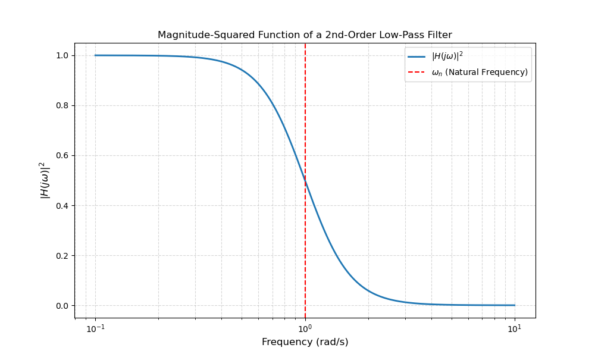
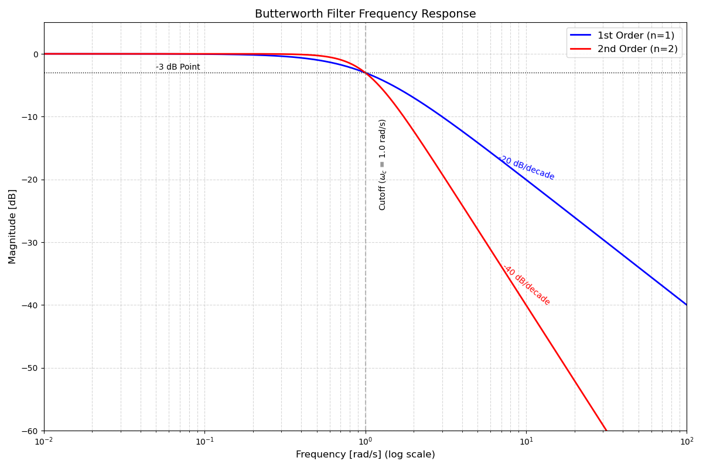

# 设计一个butter-worth filter

## 为何是巴特沃斯滤波器

首先我们需要知道我们为什么要设计一个巴特沃斯滤波器，巴特沃斯滤波器有一个重要的特点就是最大平坦通带​​（Maximally Flat Passband）：在通带内（0 ≤ ω ≤ ωₐ）幅度响应尽可能平坦（无波纹）

如图所示


这个函数是幅度平方函数，即

## 考虑一阶滤波器


### step 1 定义幅度平方响应

$|H(j\omega)|^2 = \frac{1}{1+(\frac{\omega}{\omega_c})^2n} $

其中n是滤波器阶数，$w_c$指的是截止频率


### step 2 解析延拓到s域

用 $ s = j\omega$替换，得到s域表达式:

$H(s)H(-s)=\frac{1}{(\frac{s}{j})^2}= \frac{1}{1-s^2}$

### step 3 获得极点

求分母的根，得到 $s = \pm1$

我们选择左边平面极点

$p=-1$

### step 4 构造传递函数

其实很容易观察得到，$H(s)=\frac{1}{s+1}$


## 二阶巴特沃斯滤波器推导

### Step 1 定义幅度平方响应

幅度平方函数的一般形式：
$$ |H(j\omega)|^2 = \frac{1}{1 + \left(\frac{\omega}{\omega_c}\right)^{2n}} $$

对于**二阶滤波器**（n=2）：
$$ |H(j\omega)|^2 = \frac{1}{1 + \left(\frac{\omega}{\omega_c}\right)^4} $$

---

### Step 2 解析延拓到s域

用 $s = j\omega$ 替换，得到s域表达式：
$$ H(s)H(-s) = \frac{1}{1 + \left(\frac{s}{j\omega_c}\right)^4} $$

将 $j^4 = 1$ 代入：
$$ H(s)H(-s) = \frac{1}{1 + \left(\frac{s}{\omega_c}\right)^4} $$

---

### Step 3 获得极点

求分母的根（极点）：
$$ 1 + \left(\frac{s}{\omega_c}\right)^4 = 0 $$

解得：
$$ s_k = \omega_c \cdot e^{j\frac{\pi}{4}(2k + 1)} \quad (k = 0,1,2,3) $$

具体极点位置（取 $\omega_c = 1$ 归一化）：
$$
\begin{aligned}
s_0 &= e^{j\frac{\pi}{4}} = \frac{\sqrt{2}}{2} + j\frac{\sqrt{2}}{2} \\
s_1 &= e^{j\frac{3\pi}{4}} = -\frac{\sqrt{2}}{2} + j\frac{\sqrt{2}}{2} \\
s_2 &= e^{j\frac{5\pi}{4}} = -\frac{\sqrt{2}}{2} - j\frac{\sqrt{2}}{2} \\
s_3 &= e^{j\frac{7\pi}{4}} = \frac{\sqrt{2}}{2} - j\frac{\sqrt{2}}{2}
\end{aligned}
$$

选择**左半平面极点**（$s_1$ 和 $s_2$）以保证系统稳定。

---

### Step 4 构造传递函数

将左半平面极点组合成传递函数：
$$ H(s) = \frac{\omega_c^2}{(s - s_1)(s - s_2)} $$

代入具体值（$\omega_c = 1$）：
$$
\begin{aligned}
H(s) &= \frac{1}{\left(s + \frac{\sqrt{2}}{2} - j\frac{\sqrt{2}}{2}\right)\left(s + \frac{\sqrt{2}}{2} + j\frac{\sqrt{2}}{2}\right)} \\
&= \frac{1}{s^2 + \sqrt{2}s + 1}
\end{aligned}
$$

最终标准形式：
$$ H(s) = \frac{\omega_c^2}{s^2 + \sqrt{2}\omega_c s + \omega_c^2} $$

---

### 关键特性
1. **-40 dB/decade** 高频衰减
2. **最大平坦**通带（Butterworth特性）
3. 截止频率处增益为 $-3\text{dB}$（即 $|H(j\omega_c)| = \frac{1}{\sqrt{2}}$）


## 对比一阶二阶巴特沃斯滤波器



## 详细推导过程

### 1.连续域原型（模拟滤波器）

二阶归一化巴特沃斯低通滤波器（截止频率ωₐ=1 rad/s）：

$ H_analog(s)=\frac{1}{s^2+\sqrt{2}s+1}$ 显然极点位置 $s=-\frac{-\sqrt{2}}{2}\pm j\frac{\sqrt{2}}{2}$

-3db的点:$\omega=1rad/s$

### 2.频率预畸变（关键代码变量 C）

双线性变换会导致频率扭曲，需对截止频率预补偿：

$\omega_c=2\pi f_c$

预畸变公式：

$C= \frac{1}{tan(\frac{\omega_cT}{2})} = \frac{1}{tan(\frac{\pi f_c}{f_s})} $


### 3. 双线性变换

双线性变换公式

$s = \frac{2}{T} ·\frac{1-z^{-1}}{1+z^{-1}}$ 其中T为采样间隔

双线性变换会将模拟频率($\omega_a$)和数字频率($\omega_d$)的非线性映射

$\omega_a=\frac{2}{T}tan(\frac{\omega_dT}{2})$

这种映射会导致低频段近似相等，高频段扭曲严重

为了保证数字滤波器的截止频率$\omega_d=\omega_c$准确对应模拟滤波器中的$\omega_a=\omega_c$，需要对模拟截止频率进行预畸变：

$\omega_a=\omega_c=\frac{2}{T}tan\frac{\omega_cT}{2}$

从而引入预畸变系数
$C= \frac{1}{tan(\frac{\omega_cT}{2})} = \frac{1}{tan(\frac{\pi f_c}{f_s})} $

```C++
//C++ 中如此表示
double C = 1 / std::tan(M_PI * center_freq / (double)PublicVar::ins().sample_rate);
```

修正后的双线性变换 $s = C·\frac{1-z^{-1}}{1+z^{-1}}$